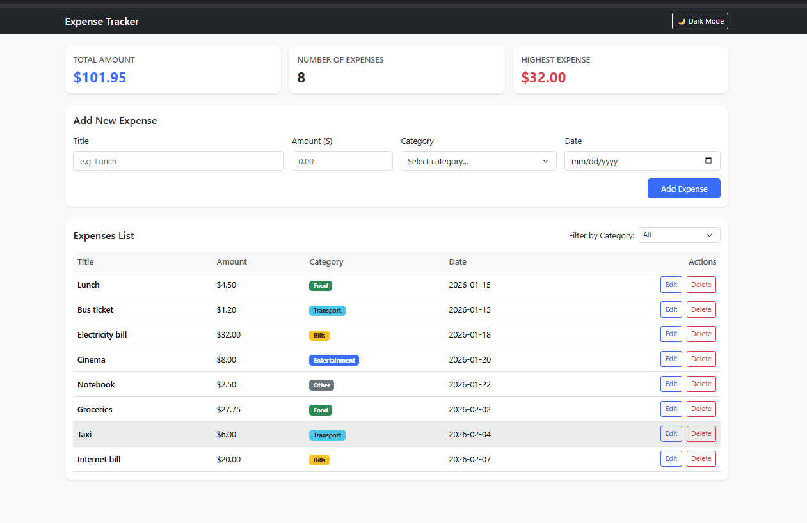
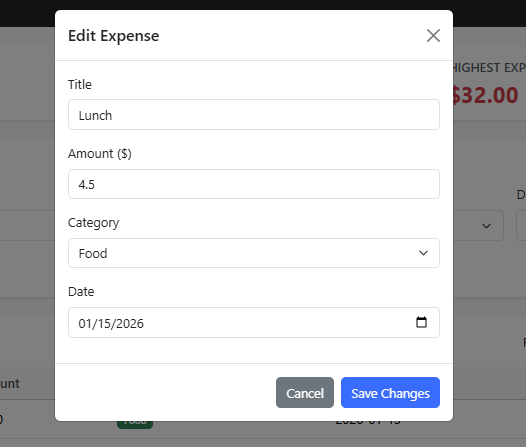

# Expense Tracker

A full-stack web application to track personal expenses using a Node.js/Express backend, a PostgreSQL database, and a Bootstrap 5 frontend. It allows users to add, edit, delete, and filter expenses while viewing real-time spending totals.
## How to run
**Backend**

1. Open pgAdmin, create a new database named `expense_tracker`, and run the SQL inside `backend/schema.sql` to create the table and sample data.
2. In VS Code, open a terminal and go to the backend folder: `cd backend`
3. Create a `.env` file inside `backend/` (copying `.env.example`) and add your PostgreSQL password:
4.Install packages and start the server:
npm install
node server.js

**Frontend**

1. Right-click frontend/index.html in VS Code and click Open with Live Server.

## Features

<!-- List what your app can do. Tick what you finished. -->

- [x] Add an expense (with validation)
- [x] Delete an expense
- [x] Edit an expense
- [x] Filter by category
- [x] Summary cards (total, count, highest)
- [x] Data is saved in a PostgreSQL database
- [x] Bonus: Dark Mode toggle

## Screenshots

## What was the hardest part?

The hardest part was handling data types between PostgreSQL and Node.js.